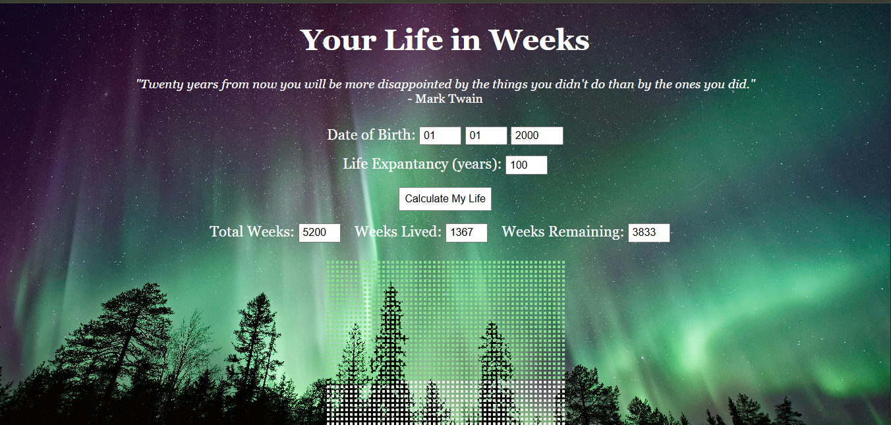

# Your Life in Weeks
A visual representation of your life in weeks. See how many weeks you've lived and how many you have left based on your life expectancy.

## Features
- Calculate total weeks, weeks lived, and weeks remaining
- Responsive design (works on mobile and tablets too)
- Visual grid representation where each box = 1 week
- Green boxes show weeks you've already lived
- White boxes show weeks remaining
- Each row represents one year (52 weeks)
- Motivational quote to inspire action

## How to Use
1. Enter your birth date (month, day, year)
2. Enter your life expectancy (default is 80 years)
3. Click "Calculate My Life"
4. View your results and visual representation

## Technologies Used
- HTML
- Vanilla JavaScript
- CSS

## Future Improvements (Planned)
- Add a small box explaining "Green = lived, White = remaining"
- Add a hover effect to show "Week #, Year X, Age Y" while hovering over a box
- Milestone markers - highlight special weeks like birthdays 
- Download/share - button to save the visualization as an image
- Different views - toggle between weeks/months/years view
- Color themes - let users choose different color schemes
- Add years labels - number the rows so you can see "Age 20, Age 30, Age 40..."
- Animation - boxes fade in one by one when calculated

## Inspiration
This project was inspired by the "Life Calendar" concept - visualizing life in weeks to encourage living intentionally and making the most of our limited time.

## Screenshot 

Note: Scroll down to see the full visualization grid!

## Live Demo
Check it out here: [Lifespan Weeks Tracker](https://lifespan-weeks-tracker.netlify.app/)

## Feedback Welcome!
Open an issue or reach out – always happy to connect.

---

*"Die with memories, not dreams."*
